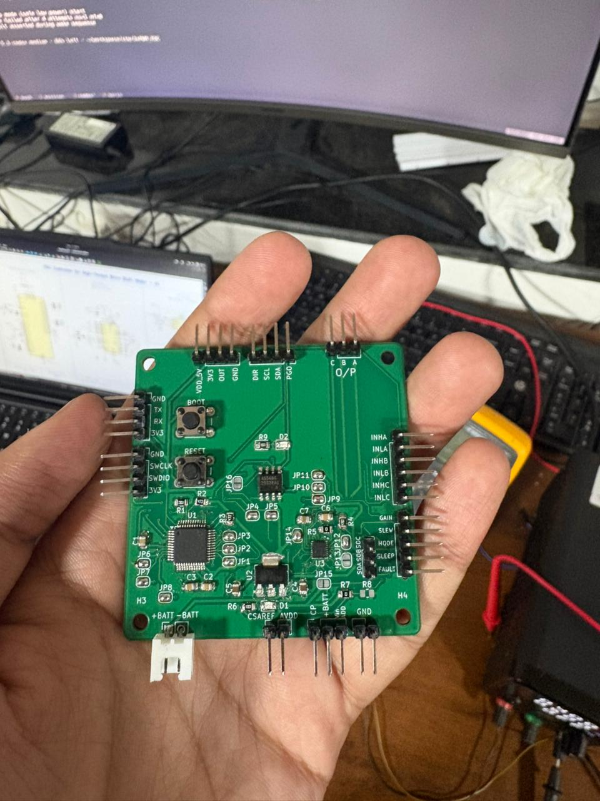
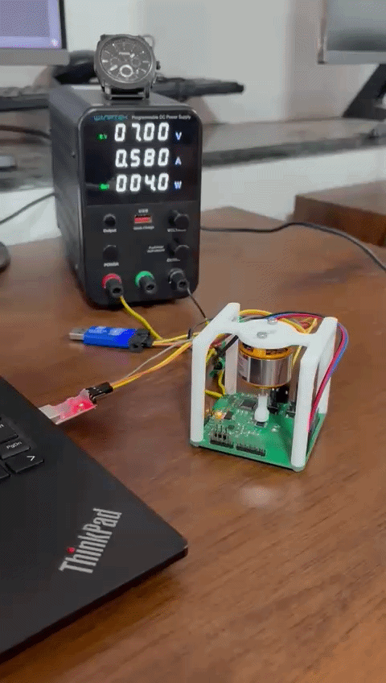

# Field-Orient-Control-for-BLDC-Motor

STM32G431 + DRV8311H BLDC control project using STM32CubeIDE.

## Main components
- `STM32G431CBT6` (MCU)
- `DRV8311H` (3-phase gate driver)
- `AS5600` (magnetic encoder)
- `LDL1117` (voltage regulator)

This repo includes:
- `firmware/3xPWM_FOC` (FOC firmware project)
- `firmware/Open_Loop_Test_DRV8311` (open-loop bring-up test)

## Hardware

### Soldered PCB

### Motor running (open-loop)

## PWM mode (3x PWM)

The firmware uses **3x PWM** with `TIM1` and complementary outputs to drive DRV8311:
- `INHA` from `PA8  (TIM1_CH1)`
- `INHB` from `PA9  (TIM1_CH2)`
- `INHC` from `PA10 (TIM1_CH3)`

- `INLA` from `PB13 (TIM1_CH1N)`
- `INLB` from `PB14 (TIM1_CH2N)`
- `INLC` from `PB15 (TIM1_CH3N)`

## Pin connections (STM32 -> DRV8311 / interface)

### Gate driver control
- `PA8  (TIM1_CH1)`  -> `INHA`
- `PA9  (TIM1_CH2)`  -> `INHB`
- `PA10 (TIM1_CH3)`  -> `INHC`

- `PB13 (TIM1_CH1N)` -> `INLA`
- `PB14 (TIM1_CH2N)` -> `INLB`
- `PB15 (TIM1_CH3N)` -> `INLC`

- `PC13 (GPIO)`      -> `nSLEEP`
- `PC14 (GPIO input)`-> `nFAULT` (pull-up)

### Current sensing
- `PA0 (ADC1_IN1)` -> `SOA`
- `PA1 (ADC2_IN2)` -> `SOB`
- `PA2 (ADC1_IN3)` -> `SOC`

### Encoder and debug
- `PA15 (I2C1_SCL)` -> AS5600 `SCL`
- `PB7  (I2C1_SDA)` -> AS5600 `SDA`
- `PB10 (USART3_TX)` -> UART TX (debug)
- `PB11 (USART3_RX)` -> UART RX (debug)
